Table of Contents:
- [FlightSurety](#flightsurety)
- [Course 4 Project: Dapp with Autonomous Smart Contracts and Oracles](#course-4-project-dapp-with-autonomous-smart-contracts-and-oracles)
	- [1. Introduction](#1-introduction)
	- [2. Project Requirements](#2-project-requirements)
			- [2.1. Separation of Concerns, Operational Control and “Fail Fast”](#21-separation-of-concerns-operational-control-and-fail-fast)
			- [2.2 Airlines](#22-airlines)
			- [2.3. Passengers](#23-passengers)
			- [2.4. Oracles (Server App)](#24-oracles-server-app)
	- [3. Install](#3-install)
		- [3.1 Setting Up the Project:](#31-setting-up-the-project)
			- [3.1.1 Repo](#311-repo)
			- [3.1.2 Node Version](#312-node-version)
			- [3.1.3 Packages](#313-packages)
			- [3.1.4 GANACHE setup](#314-ganache-setup)
	- [4. Develop Client](#4-develop-client)
	- [5. Develop Server](#5-develop-server)
	- [6. Test your dapp](#6-test-your-dapp)
		- [6.1 Submit a Flight to the Oracles](#61-submit-a-flight-to-the-oracles)
		- [6.2 Purchase insurance](#62-purchase-insurance)
		- [6.2.1 Example without payout](#621-example-without-payout)
		- [6.2.2 Example without with payout](#622-example-without-with-payout)
	- [7. Deploy](#7-deploy)
	- [7. Resources](#7-resources)

# FlightSurety
# Course 4 Project: Dapp with Autonomous Smart Contracts and Oracles

## 1. Introduction

In this project, you’ll build a decentralized application for a use case in which you have airlines that offer flight delay insurance, and passengers who carry this insurance, and who get paid in the event their flight is delayed. You’ll build multiple smart contracts which are autonomously triggered by external sources, and which handle payments based on flight delay scenarios.

In the real-world, many smart contracts perform actions based on external triggers. These triggers can be caused by our actions, or by data received from outside sources using what are known as “oracles.” To make real-world decentralized applications, smart contracts need to respond autonomously to these triggers, thereby making these applications more interactive.


## 2. Project Requirements
There are four main requirements for the project:

- 1. Separation of Concerns, Operational Control and “Fail Fast”
- 2. Airlines
- 3. Passengers
- 4. Oracles


#### 2.1. Separation of Concerns, Operational Control and “Fail Fast”

| CRITERIA | MEETS SPECIFICATIONS | Status |
|:-------:|:-------|:--------|
| Smart Contract Separation | Smart Contract code is separated into multiple contracts:<br> 1) FlightSuretyData.sol for data persistence <br> 2) FlightSuretyApp.sol for app logic and oracles code | :ok_hand: |
| Dapp Created and Used for Contract Calls |A Dapp client has been created and is used for triggering contract calls. Client can be launched with “npm run dapp” and is available at http://localhost:8000<br>Specific contract calls:<br>1) Passenger can purchase insurance for flight<br>2) Trigger contract to request flight status update | :ok_hand: |
| Oracle Server Application | A server app has been created for simulating oracle behavior. Server can be launched with “npm run server” | :ok_hand: |
| Operational status control is implemented in contracts | Students has implemented operational status control. | :ok_hand: |
| Fail Fast Contract | Contract functions “fail fast” by having a majority of “require()” calls at the beginning of function body | :ok_hand: |

#### 2.2 Airlines

| CRITERIA | MEETS SPECIFICATIONS | Status |
|:-------:|:-------|:--------|
| Airline Contract Initialization | First airline is registered when contract is deployed. | :ok_hand: |
| Multiparty Consensus | Only existing airline may register a new airline until there are at least four airlines registered* | :ok_hand: |
| Multiparty Consensus | Registration of fifth and subsequent airlines requires multi-party consensus of 50% of registered airlines* | :ok_hand: |
| Airline Ante | Airline can be registered, but does not participate in contract until it submits funding of 10 ether | :ok_hand: |

\* Demonstrated either with Truffle test or by making call from client Dapp


#### 2.3. Passengers

| CRITERIA | MEETS SPECIFICATIONS | Status |
|:-------:|:-------|:--------|
| Passenger Airline Choice| Passengers can choose from a fixed list of flight numbers and departure that are defined in the Dapp client | :ok_hand: |
| Passenger Payment | Passengers may pay up to 1 ether for purchasing flight insurance. | :ok_hand: |
| Passenger Repayment | If flight is delayed due to airline fault, passenger receives credit of 1.5X the amount they paid | :ok_hand: |
| Passenger Withdraw | Passenger can withdraw any funds owed to them as a result of receiving credit for insurance payout | :ok_hand: |
| Insurance Payouts | Insurance payouts are not sent directly to passenger’s wallet | :ok_hand: |


#### 2.4. Oracles (Server App)

| CRITERIA | MEETS SPECIFICATIONS | Status |
|:-------:|:-------|:--------|
| Functioning Oracle | Oracle functionality is implemented in the server app. | :ok_hand: |
| Oracle Initialization | Upon startup, 20+ oracles are registered and their assigned indexes are persisted in memory | :ok_hand: |
| Oracle Updates | Update flight status requests from client Dapp result in OracleRequest event emitted by Smart Contract that is captured by server (displays on console and handled in code) | :ok_hand: |
| Oracle Functionality | Server will loop through all registered oracles, identify those oracles for which the OracleRequest event applies, and respond by calling into FlightSuretyApp contract with random status code of Unknown (0), On Time (10) or Late Airline (20), Late Weather (30), Late Technical (40), or Late Other (50) | :ok_hand: |


## 3. Install

### 3.1 Setting Up the Project:

This project folder contains the Smart Contract code in Solidity (using Truffle), test (also using Truffle), dApp scaffolding (using HTML, CSS, JS) and server app scaffolding.

To setup the project we require you have the following pre installed:

| package | Version |
|:-------:|:-------:|
| nodejs | 10.12.0 |
| npm | 6.4.1 |
| Truffle | 5.1.63 |
| Solidity | 0.4.24 |
| web3.js | 1.2.9 |
| Ganache | 2.5.4 |

This repository contains Smart Contract code in Solidity (using Truffle), tests (also using Truffle), dApp scaffolding (using HTML, CSS and JS) and server app scaffolding.

#### 3.1.1 Repo

To install, download or clone the repo.

#### 3.1.2 Node Version

Use nvm to run multiple versions of node. Select and install node version 10.12.0:

```bash
nvm list available
nvm install 10.12.0
nvm use 10.12.0
```

#### 3.1.3 Packages

To install all necessary dependencies, run:
`npm install` from the root folder of this project.
And `npm audit fix`

Update or install your truffle:
`npm install truffle -g`


#### 3.1.4 GANACHE setup

Download and install Ganache v2.5.4: <https://www.trufflesuite.com/ganache>

Run Ganache follow the steps:
- on `Workspace` Tab:
	- select `NEW WORKSPACE - Ethereum`
	- enter Workspace name: `FligthSurety`
	- click on `ADD PROJECT` and add the `truffle.js` file.
- on `Server` Tab:
	- change `Port number` to `9545`.
- on `Accounts and Keys` Tab:
	- change `TOTAL ACCOUNTS TO GENERATE` to 40
	- change the `Mnemonic` to `depart quit survey faint message service talk spider urge dynamic jewel fancy`
- on `Chain` Tab:
	- change the `GAS LIMIT` to `67219750`
- Then click on `SAVE WORKSPACE` button.

Open your saved workspace:

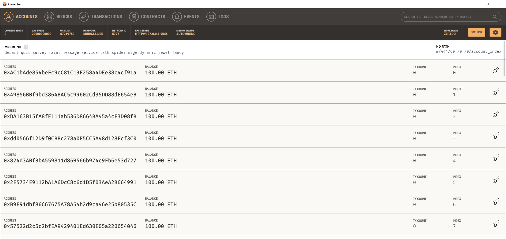

## 4. Develop Client

To build the project, run:
`truffle compile`

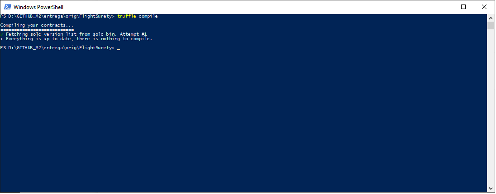

To run truffle tests:

`truffle test ./test/flightSurety.js`

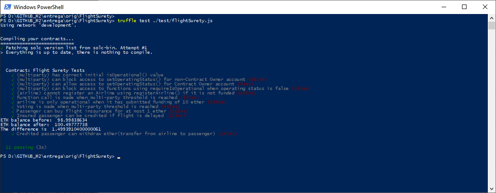

`truffle test ./test/oracles.js`

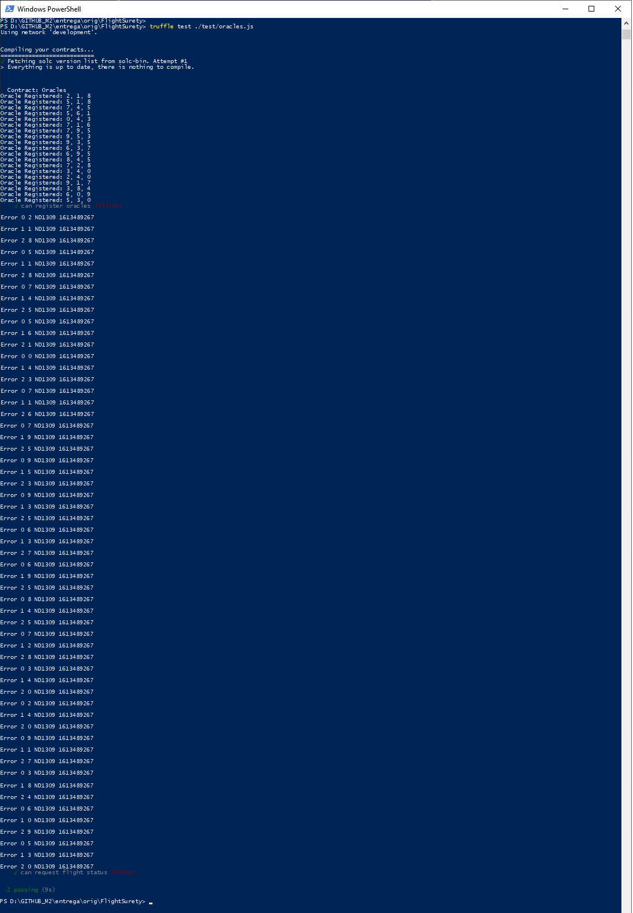

To use the dapp:

`truffle migrate --reset`

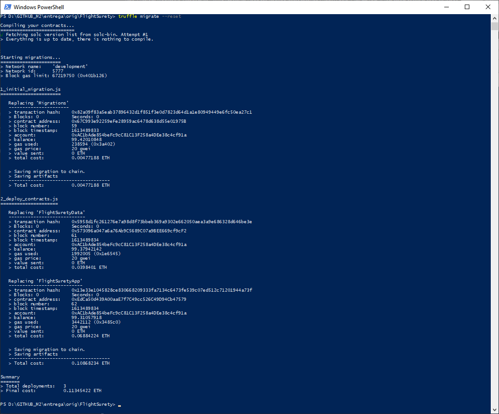

Check deployed smart contracts:

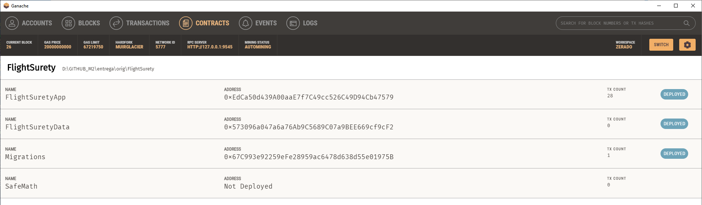

`npm run dapp`

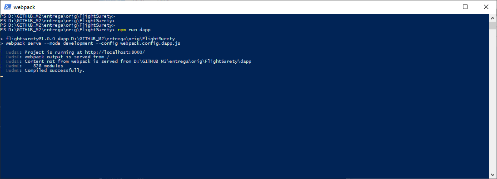

To view dapp:

`http://localhost:8000`


## 5. Develop Server

Open new terminal and run:
`npm run server`

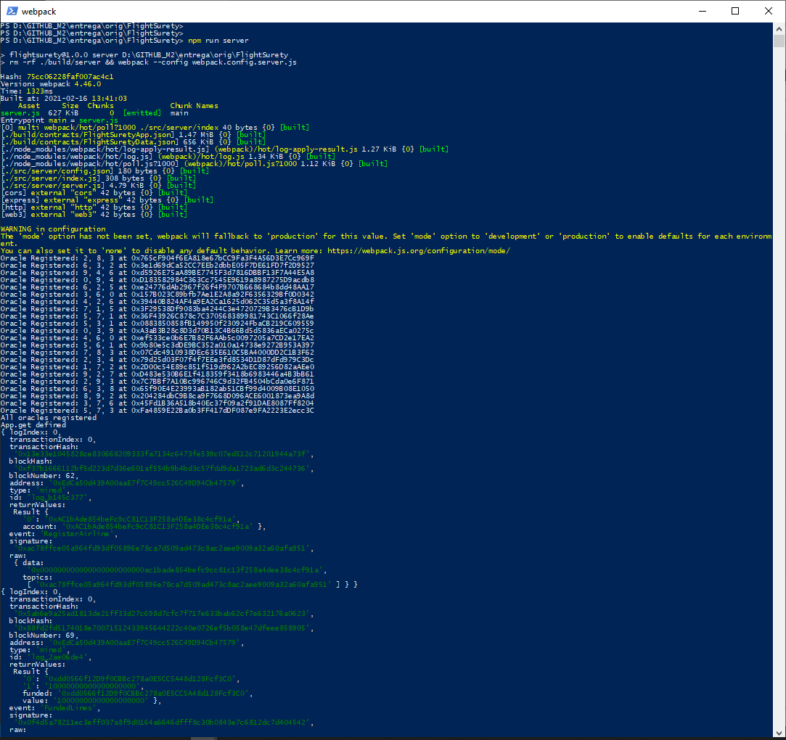


## 6. Test your dapp

### 6.1 Submit a Flight to the Oracles

Open your browser in `http://localhost:8000`

Select one Flight and a Departure date:


### 6.2 Purchase insurance

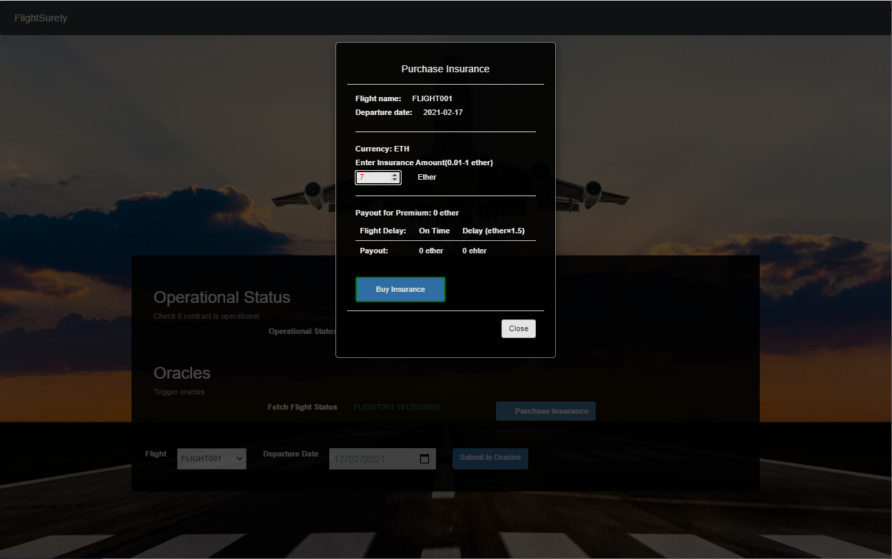

### 6.2.1 Example without payout


### 6.2.2 Example without with payout

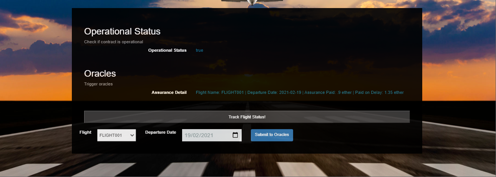

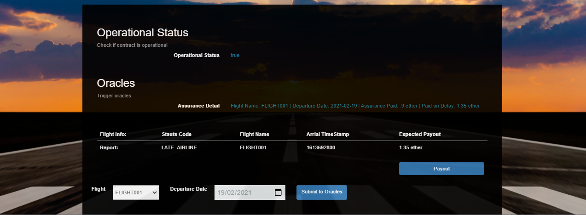

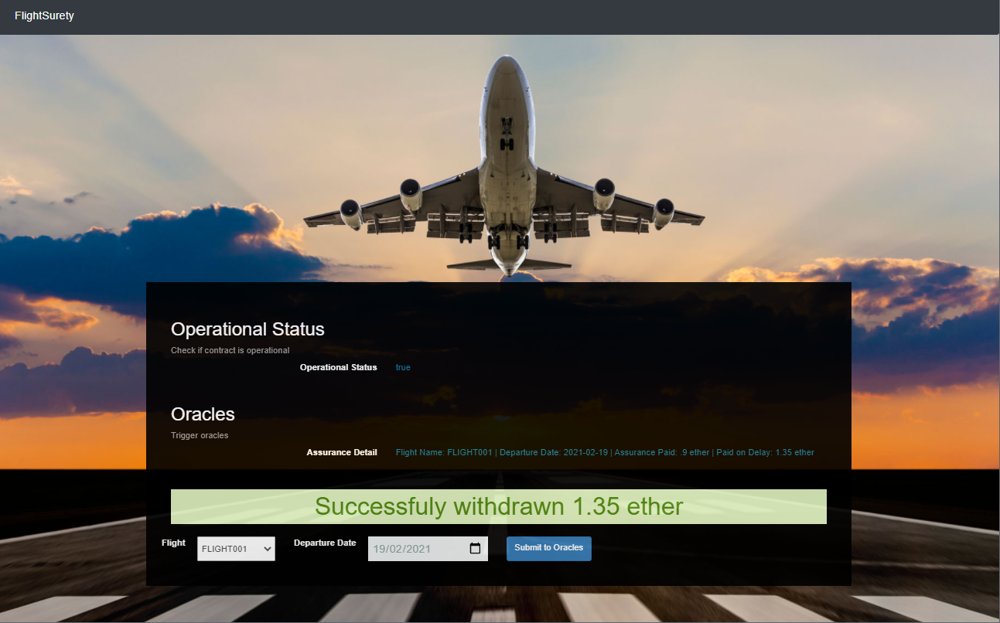

## 7. Deploy

To build dapp for prod:
`npm run dapp:prod`

Deploy the contents of the ./dapp folder


## 7. Resources

* [How does Ethereum work anyway?](https://medium.com/@preethikasireddy/how-does-ethereum-work-anyway-22d1df506369)
* [BIP39 Mnemonic Generator](https://iancoleman.io/bip39/)
* [Truffle Framework](http://truffleframework.com/)
* [Ganache Local Blockchain](http://truffleframework.com/ganache/)
* [Remix Solidity IDE](https://remix.ethereum.org/)
* [Solidity Language Reference](http://solidity.readthedocs.io/en/v0.4.24/)
* [Ethereum Blockchain Explorer](https://etherscan.io/)
* [Web3Js Reference](https://github.com/ethereum/wiki/wiki/JavaScript-API)

* tip: If you would like to update packages to last version available then run the following command: `ncu -u`. But be aware that you probably need to update the smart contract code and other things that can be deprecated or needed.
